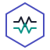

<p align="center">
  <picture>
    <source media="(prefers-color-scheme: dark)" srcset="docs/public/openobs-logo.svg" />
    <source media="(prefers-color-scheme: light)" srcset="docs/public/openobs-logo-dark.svg" />
    
  </picture>
</p>

<h1 align="center">OpenObs</h1>

<p align="center">
  <strong>The open-source AI-native observability platform.</strong><br />
  Investigate incidents, generate dashboards, and manage alerts — powered by LLMs.
</p>

<p align="center">
  <a href="https://github.com/PerforMance308/prism/actions/workflows/ci.yml"></a>
  <a href="https://github.com/PerforMance308/prism/blob/main/LICENSE"></a>
  <a href="https://docs.openobs.com"></a>
</p>

<p align="center">
  <a href="https://openobs.com">Website</a> &middot;
  <a href="https://docs.openobs.com">Documentation</a> &middot;
  <a href="#quick-start">Quick Start</a> &middot;
  <a href="#deploy-with-helm">Helm Install</a>
</p>

---

<p align="center">
  
</p>

## What is OpenObs?

OpenObs turns natural language into production-grade observability workflows:

- **Dashboard generation** &mdash; Describe what you want to monitor. OpenObs discovers metrics from your Prometheus instance and builds dashboards with real PromQL queries.
- **Incident investigation** &mdash; Ask a question about your system. OpenObs plans an investigation, queries your metrics, and writes a structured report with evidence.
- **Alert rule management** &mdash; Create alert rules through conversation. *"Alert me when p95 latency exceeds 500ms."*
- **Conversational editing** &mdash; Chat with any dashboard to add panels, rearrange layouts, modify queries, or dig deeper into anomalies.

## Quick Start

```bash
git clone https://github.com/PerforMance308/prism.git && cd prism
npm install
cp .env.example .env      # set JWT_SECRET (min 32 chars)
npm run build
npm run start              # API on :3000, Web on :5173
```

Open **http://localhost:5173** &mdash; the setup wizard walks you through connecting an LLM provider and data sources.

### Requirements

| Requirement | Notes |
|---|---|
| **Node.js 20+** | Required |
| **LLM provider** | Anthropic, OpenAI, Gemini, DeepSeek, Ollama, or Azure/Bedrock |
| **Prometheus** | Optional &mdash; dashboards work without one, but metric discovery and investigation require it |

## Deploy with Docker

```bash
docker build -t openobs:latest .
docker run --rm -p 3000:3000 \
  -e JWT_SECRET='your-secret-min-32-chars' \
  -e LLM_API_KEY='your-provider-key' \
  -v openobs-data:/var/lib/openobs \
  openobs:latest
```

Then open **http://localhost:3000**.

## Deploy with Helm

```bash
helm upgrade --install openobs ./helm/openobs \
  --namespace observability --create-namespace \
  --set image.repository=ghcr.io/PerforMance308/prism \
  --set image.tag=latest \
  --set secretEnv.LLM_API_KEY='your-provider-key'
```

See the full [Kubernetes install guide](https://docs.openobs.com/install/kubernetes) for ingress, Postgres, Redis, and persistence options.

## Architecture

OpenObs is a TypeScript monorepo with 9 packages:

```
common            Shared types, errors, and utilities
llm-gateway       Multi-provider LLM abstraction (Anthropic, OpenAI, Gemini, Ollama, ...)
data-layer        Persistence layer (SQLite / Postgres via Drizzle ORM)
adapters          Observability backend connectors (Prometheus, logs, traces)
adapter-sdk       SDK for building custom execution adapters
guardrails        Safety guards, cost controls, and action policies
agent-core        AI agent logic — orchestration, investigation, dashboard generation
api-gateway       Express HTTP server, REST API, WebSocket
web               React SPA (Vite + Tailwind CSS)
```

See [ARCHITECTURE.md](./ARCHITECTURE.md) for the full dependency graph and design patterns.

## Configuration

All configuration is via environment variables or the interactive setup wizard at `/setup`.

<details>
<summary><strong>Environment variable reference</strong></summary>

| Variable | Required | Description |
|---|---|---|
| `JWT_SECRET` | Yes | Signing key for auth tokens (min 32 chars) |
| `LLM_PROVIDER` | No | Default LLM provider (configured via setup wizard) |
| `LLM_API_KEY` | No | API key for the LLM provider |
| `LLM_MODEL` | No | Default model name |
| `DATABASE_URL` | No | Postgres connection string; omit for SQLite |
| `REDIS_URL` | No | Redis connection string |
| `CORS_ORIGINS` | No | Comma-separated allowed origins |
| `API_KEYS` | No | Service API keys for server-to-server access |
| `LOG_LEVEL` | No | `debug` / `info` / `warn` / `error` |

Copy `.env.example` for the full list with defaults.

</details>

## Development

```bash
npm run build        # TypeScript build (all packages)
npm test             # Vitest (all packages)
npm run start        # API + web dev servers
npm run docs:dev     # VitePress docs dev server
```

## Contributing

See [CONTRIBUTING.md](./CONTRIBUTING.md) for development setup, code style, and where to put new code.

## License

[MIT](./LICENSE)
